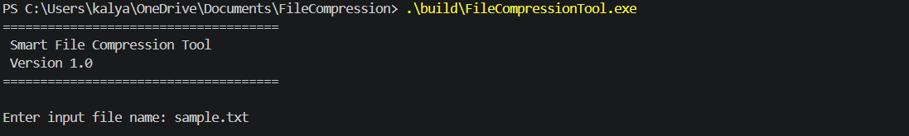
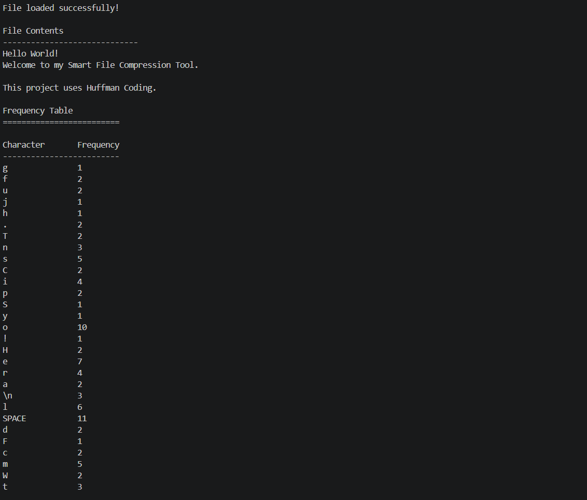
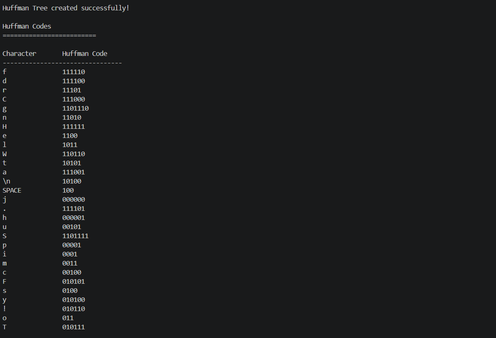
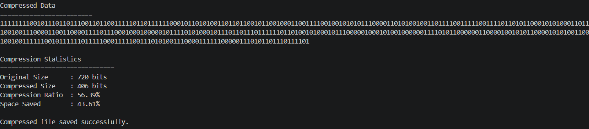
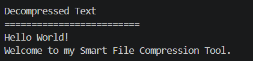

 # 📦 File Compression Tool

A C++ implementation of the **Huffman Coding Algorithm** for lossless text file compression and decompression.

---

## 🚀 Features

- 📄 Read text files
- 📊 Count character frequencies
- 🌳 Build Huffman Tree
- 🔑 Generate Huffman Codes
- 📦 Compress text files
- 🔓 Decompress compressed files
- 📈 Display compression statistics

---

## 🛠️ Technologies Used

- C++17
- STL
- CMake

---

## 📚 Data Structures

- Binary Tree
- Priority Queue (Min Heap)
- Unordered Map

---

## 🧠 Algorithm

- Huffman Coding
- Greedy Algorithm

---

## 📂 Project Structure

```
FileCompressionTool/
│
├── include/
├── src/
├── input/
├── output/
├── docs/
│   └── images/
├── tests/
├── CMakeLists.txt
├── README.md
├── LICENSE
└── .gitignore
```

---

## ⚙️ Build

```bash
mkdir build
cd build
cmake ..
cmake --build .
```

---

## ▶️ Run

```bash
./FileCompressionTool
```

On Windows:

```bash
.\FileCompressionTool.exe
```

---

## 🔄 Workflow

```
Input File
    │
    ▼
Read File
    │
    ▼
Count Frequencies
    │
    ▼
Build Huffman Tree
    │
    ▼
Generate Codes
    │
    ▼
Compress
    │
    ▼
compressed.huff
    │
    ▼
Decompress
    │
    ▼
Original File
```

---
## 📸 Screenshots

### Program Start



---

### Frequency Table



---

### Huffman Codes



---

### Compression Statistics



---

### Decompressed Output




## 📖 Concepts Learned

- Object-Oriented Programming
- File Handling
- Dynamic Memory Allocation
- Priority Queue
- Trees
- Recursion
- Greedy Algorithms
- STL Containers

---

## 🚀 Future Improvements (Version 2)

- Binary bit-level compression
- Store Huffman Tree in file
- Better compression ratio
- Interactive menu
- Support multiple file types

---

## Authors
- Avireddy Naga Venkata Kalyan Ram
- Ghanta Pothan Sai Vamsi
- Pentakota Shyam Sai Durga Mallikarjun 